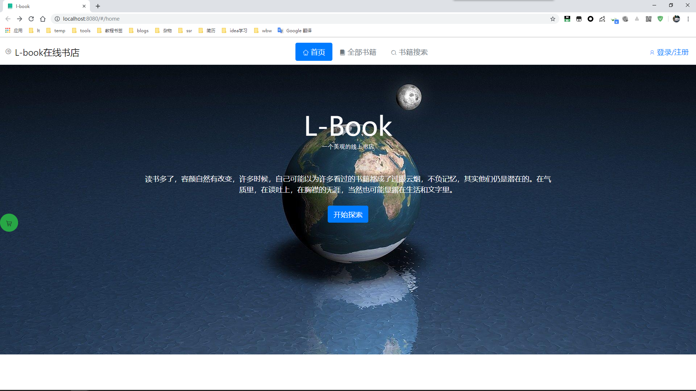
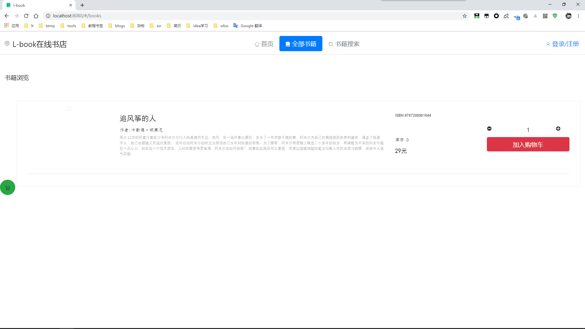
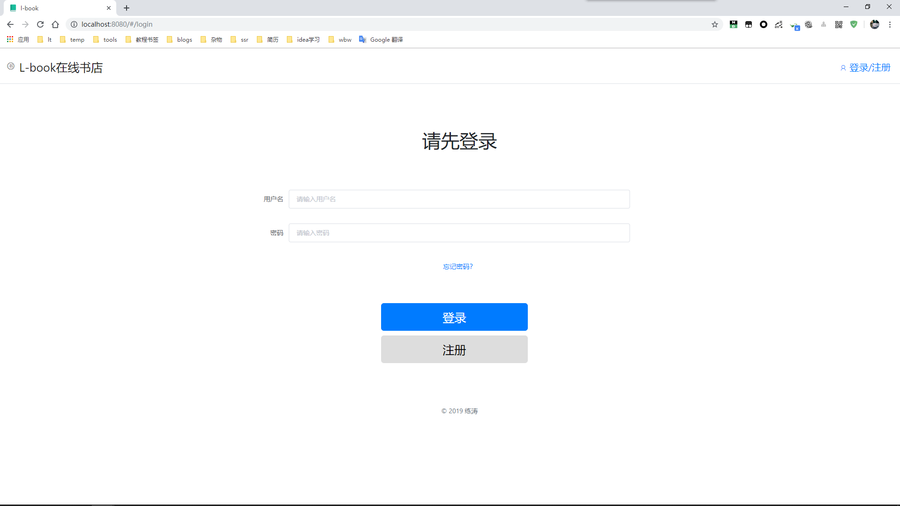

### 技术栈：
### 后端
1. Maven 
2. SpringBoot 
3. SpringActuator 
4. SpringSecurity 
5. MyBatis 
6. Jackson

### 前端
1. Vue
2. ElementUI
3. BootStrap
4. Axios
5. vuex 
6. vue-cli

## 数据库
- MySQL 
- mongoDB

## 功能
- 首页
- 登录，登出
- 书籍展示及详情
- 购物车
- 下单
- 个人订单
- 购买记录

## 管理员功能
- 书籍管理
- 用户权限
- 订单管理
- 搜索订单
- 订单统计

## 快速开始
clone以下：
#### L-book-client
#### L-book-server
client: 运行：`npm install`,`npm run serve`
server: 运行sql后脏的lbook.sql脚本,run项目即可。

## 预览图
#### home

#### books

#### login

